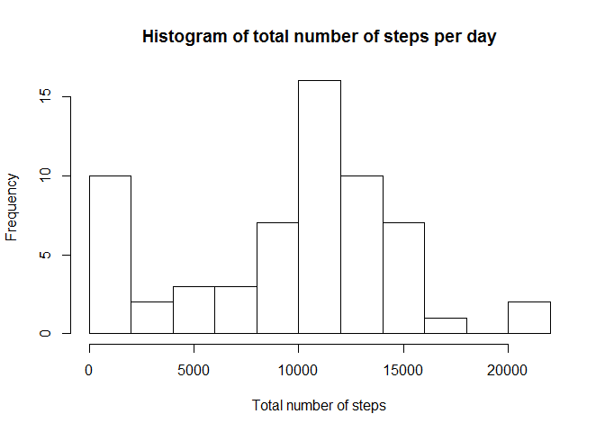
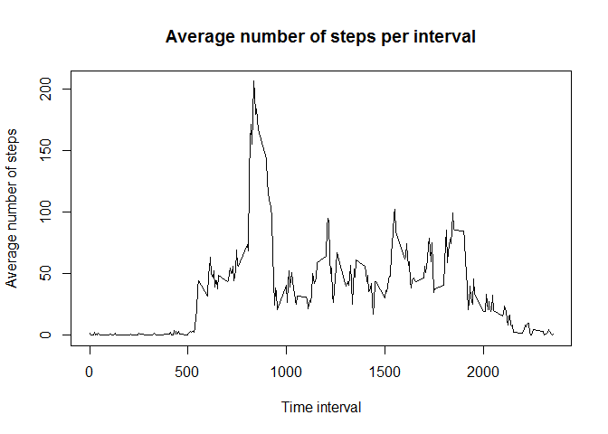
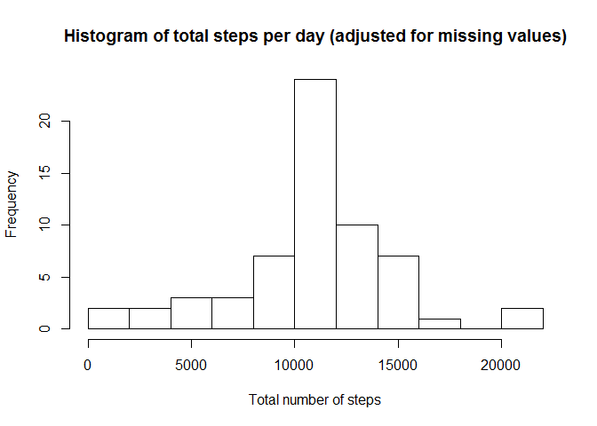
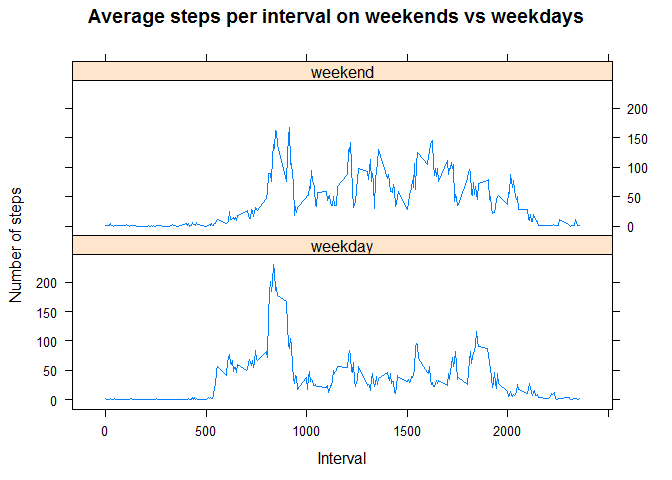

# Reproducible Research: Peer Assessment 1
This exercise is a Course Project from the Reproducible Ressearch course offered by Coursera and the John Hopkins Bloomberg School of Public Health.


## Loading and preprocessing the data
The  data file "activity.csv" was loaded using the following code:

```r
## unzip and read in the data file
unzip("activity.zip")
data <- read.csv("activity.csv")
## transform the dates to a date format
data$date <- as.Date(data$date)
```


## What is mean total number of steps taken per day?
The following code uses the "dplyr" package in calculating the total number of steps per day and outputs a histogram of the total number of steps per day.

```r
## NB Ignore missing values for this part of the assignment
## calculate the total number of steps taken per day using the dplyr package
suppressMessages(library(dplyr))
totalsteps.perday <- group_by(data,date)
totalsteps <- summarise(totalsteps.perday,sum(steps,na.rm=TRUE))
colnames(totalsteps)<-c("Date","Total.Steps")
## plot the histogram
hist(totalsteps$Total.Steps,breaks=10,xlab="Total number of steps",
     main="Histogram of total number of steps per day")
```

 

Because we are ignoring missing values (as instructed), the total number of steps on days which only have missing values is zero.  Thus, 8 of the 10 observations in the first cell (0-2000 steps) of the above histogram are the days for which all the values are missing.

The following code was used to calculate the mean and median total number of steps taken per day.

```r
## calculate the mean and median (ignoring missing values)
meansteps <- mean(totalsteps$Total.Steps)
mediansteps <- median(totalsteps$Total.Steps)
```
Ignoring missing values, the mean number of steps taken per day is 9354.23 and the median number is 10395.


## What is the average daily activity pattern?
The following code was used to calculate the average number of steps for each 5-minute interval which is used to produce the time series plot below:

```r
## calculate the average number of steps per interval using the dplyr package
averagesteps.perint <- group_by(data,interval)
averagesteps <- summarise(averagesteps.perint,mean(steps,na.rm=TRUE))
colnames(averagesteps)<-c("Interval","Average")
## plot the time series
plot(averagesteps$Interval,averagesteps$Average,type="l",
     main="Average number of steps per interval",
     xlab="Time interval",ylab="Average number of steps")
```

 

This code was used to identify the 5-minute interval which contains the maximum number of steps:

```r
## calculate the max average
maxint <- averagesteps[which.max(averagesteps$Average),1]
```
The 5-minute interval which, on average across all the days in the dataset, contains the maximum number of steps is 835.


## Imputing missing values

```r
## calculate and report the total number of missing values in the dataset
## (i.e. the total number of rows with NAs)
count.na <- sum(is.na(data))
```
The total number of missing values in the dataset is 2304.

To create a dataset with the missing values filled in, the (unsophisticated) approach of replacing each "NA" with the mean for that 5-minute interval is used.  This is achieved using the following code which also generates a new histogram:

```r
## Devise a strategy for filling in all of the missing values in the dataset. 
## As the missing values are spread nicely across the 5-minute intervals, create
## a new dataset with each missing value replaced with the mean for the interval.
n <- nrow(data)
newdata <- data
for (i in 1:n){
  if (is.na(newdata[i,1])){
    newdata[i,1] <- mean(data$steps[data$interval==data[i,3]],na.rm=TRUE)
  }
}
## Make a histogram of the total number of steps taken each day
newtotalsteps.perday <- group_by(newdata,date)
newtotalsteps <- summarise(newtotalsteps.perday,sum(steps,na.rm=TRUE))
colnames(newtotalsteps)<-c("Date","Total.Steps")
hist(newtotalsteps$Total.Steps,breaks=10,xlab="Total number of steps",
     main="Histogram of total steps per day (adjusted for missing values)")
```

 


```r
## Calculate and report the mean and median total number of steps taken per day
newmean <- mean(newtotalsteps$Total.Steps)
newmedian <- median(newtotalsteps$Total.Steps)
```
After adjusting for missing values, the mean number of steps taken per day is  10766.19 and the median number is (also) 10766.19.  Note that both the mean and the median have increased compared to the earlier calculation when we ignored the missing values.  This is because ignoring the missing vlaues effectively treated them as zero.  There are 8 days on which all the values are missing so when we replace the missing values with a (non-zero) mean, the impact is to increase the total number of steps on those 8 days from zero to the mean on the other 53 days 10766.19.  This moves 8 observations from the first cell (0-2000 steps) to the middle cell (10000-12000 steps).  This increases the mean, but also moves the median to the mean as we now have 8 observations of it.


## Are there differences in activity patterns between weekdays and weekends?
The following code is used to append another column to the data to identify weekdays vs weekends:

```r
## Append a column for weekday vs weekend
wkday <- weekdays(newdata$date)
daytype <- wkday
for (i in 1:n){
  if (wkday[i]=="Saturday"|wkday[i]=="Sunday"){
    daytype[i] <-"weekend"
  } else {
      daytype[i] <-"weekday"
  }
}
newdata <- cbind(newdata,daytype)
```
We then calculate the average number of steps for each time interval for weekdays and weekends and generate the required panel plot using the following code:

```r
## calculate the average number of steps taken per interval using the dplyr
## package
day.avgsteps.perint <- group_by(newdata,interval,daytype)
day.avgsteps<-summarise(day.avgsteps.perint,mean(steps))
colnames(day.avgsteps)<-c("Interval","daytype","Average")
## Plot the two time series using lattice
suppressMessages(library(lattice))
xyplot(Average~Interval|daytype,data=day.avgsteps,type="l",layout=c(1,2),
       main="Average steps per interval on weekends vs weekdays",
       ylab="Number of steps")
```

 

From this, we observe that (unsurprisingly), activity does differ between weekdays and weekends, with participants typically being more active at the start and end of the working day than during it on weekdays compared to weekends.
